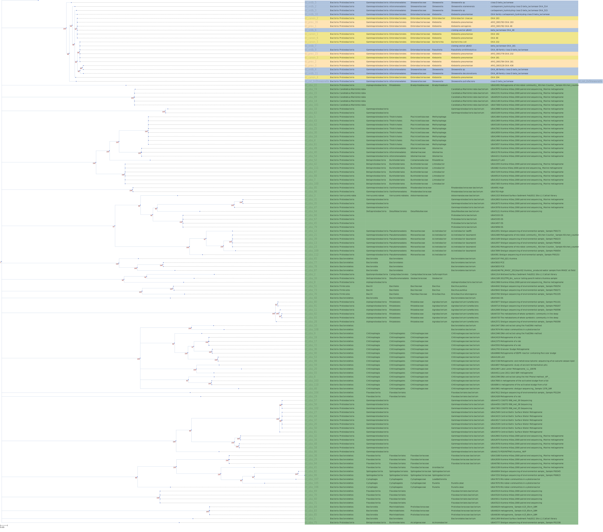

## Results

### Phylogenetic analysis of MCR sequences

The phylogenetic relationships of the CARD canonical sequences, and the CARD prevalence sequences involving the MCR family were investigated to show the pylogenetic relationship of only the putative MCR sequences without the noise of additional sequences.
A total of 87 genes, an out-group, the 32 canonical sequences, and the 54 prevalence sequences (clustered as per Table {@tbl:exp-params}), were selected for analyses.
The tree in Figure {@fig:canon-prev-tree} shows several distinct clades.
Each MCR variant forms a clade.
MCR-1, MCR-2, and MCR-6 form a clade, appearing to more closely related to one another than with the other MCR family members.
This clade is also closely related to the ICR-Mc clade.
ICR-Mc @doi:10/gdnrmn is another phosphoethanolamine transferase which confers colistin resistance.

{#fig:canon-prev-tree}

The relationships were then collapsed to representative sequences for each numbered MCR variant in figure {@fig:canon-prev-tree-collapsed} for a more condensed visualization of the overall MCR family relationships. 

From figure {@fig:canon-prev-tree-collapsed} the gradient of diversity between some variants is occupied, such as the relationship of MCR 1, 2, and 6 and ICR-Mc, and MCR 7, 3, and 9.
There are also relationships in which this diversity is missing, where unrepresented clades of MCR could exist.

{#fig:canon-prev-tree-collapsed}

In an attempt to discover these potential clades between these named MCR families, sequences from the NCBI non-redundant data were added to the analysis to be compared with the canonical and prevalence sequences.
This resulted in a total of 409 sequences for subsequent analysis, all labeled as phosphoethanolamine lipid A transferase genes, where 104 hits were labeled as MCR family genes.

In addition, the 7903 draft quality MAGs were queried for AMR genes with RGI.
RGI produced 1457246 results AMR determinants under the loose cutoff from the UBA data, 7171 for the strict cutoff,and 310 for the loose cutoff.
It was hoped that pyhlogenetic analysis could find AMR determinants would be found in under the loose criterion that may have been missed by RGI-CARD.
The UBA BLAST results were included in the phylogeny in Figure {@fig:canon-prev-nrdb-uba-tree} for the analysis.
The remainder of the analysis deals with relationships which are deemed to be interesting based on the locations of the UBAs between MCR family clades.

Between the clade containing MCR 3, and the most recent common ancestor of MCR 3 and MCR 7 clades (figure {@fig:mcr-3-9}), there is a clade of sequences from NCBI which have been reported as MCR 3 [TODO: look at linked literature].
Present within this clade is a single UBA result, UBA705, which the Parks data @doi:10/cczd reports as a Comparative metagenome analyses of anode-associated microbial communities developed in rice paddy field-soil microbial fuel cells, is reported to be *Aeromonas hydrophilia*.
This present within the clade alone with several other canonical and non-redundant Aeromonadalacea.
Aeromonas hydrophilia is a species which has been found to have an MCR-3 gene.
Even though qualities vary (Table ??), the sequences branch in the expected location.

Between the clade containing MCR 7, and the most recent common ancestor of MCR 3 and MCR 7 clades, a clade of phosphoethanolamine lipid A transferase clade appears.
This clade consists of the genus of gram negative bacteria, *Aeromonas*, @doi:10/cbnfww which is sometimes involved in human infection.
This clade also includes an *Aeromonas veroni* hit from  from epidermal mucus of *Anguilla anguilla* in the UBA data.
Between MCR 9 and the most recent common ancestor of MCR 3 and 9, a clade of *Aeromonas* associated phosphoethanolamine lipid A transferases appear.

The MCR 9 containing clade contains 8 UBAs and several NCBI non-redundant hits not reported as MCR family genes.
5 Loose hits for MCR in a *Leclercia adecarboxyla* branch within this clade. 
These *Leclercia* branch below the common ancestor of MCR-9 and MCR-3 which are well supported. The *Leclercia* UBAs were all sampled from New York City MTA subway samples Metagenome.
Acinetobacter is another opportunistic pathogen  @doi:10/b2zr9k which is becoming resistant to many antimicrobials.

![Clade containing putative MCR3 and MCR 9 clades pruned from Phylogenetic relationship of 32 canonical (labels prefixed with lcl_canon_ in yellow), and 54 prevalence (labels prefixed with lcl_prev_ in tan) MCR family sequences, 595 NCBI non-redundant sequences (labels prefixed with lcl_prev_ in blue), and 91 UBA sourced sequences (labels prefixed with lcl_prev_ in green). Each MCR variant is coloured based on its primary numerical value. If the sequence is not reported to be MCR family it is coloured in grey.](images/mcr3_mcr9_diversity.svg){#fig:mcr-3-9}

Between MCR 5 and ICR-Mc (figure {#fig:mcr-5-icr}), there appear clades of diversity in the genus *Psychrobacter*.
Branching between these two clades, as a descendant to this ancestor, is a clade of *Psycrobacter* species bacteria.
This clade includes several hits from the non-redundant database, and two hits from the UBA data.
According to the Parks @doi:10/cczd data, the identity of these samples are,
UBA3068, A *Psychrobacter sp.*, sampled from Oil polluted marine microbial communities from Coal and Oil in Point Santa Barbara, California, USA
and, UBA4193, a *Psychrobacter sp.*, sampled from the New York City MTA subway samples.
The quality information for these sequences, shown in Table ??, shows that UBA3068 is near complete, while UBA4193 is only partial.
It is encouraging to see that even with the quality difference, these two sequences branch in the expected clade.
*Psychrobacter* @doi:10/dbpr is a Genus is widespread and includes many cold adapted bacteria, it is an opportunistic pathogen, and has been found sometimes be a cause of infections in humans, animals, and fish. Many new species of *Psychrobacter* have been discovered in cold climates @doi:10/fd9rb9. Some of the species have been shown to be resistant to colistin, like *Psychrobacter vallis ps. nov.* and *Psychrobacter aquaticus ps. nov.* @doi:10/cdq9w4 and is sister to [TODO: display new tree such that *Acinetobacter* is shown]
Another clade between these two variants contains phosphoethanolamine transferases from the genus *Stenotrophomonas*, including *Stenotrophomonas maltophilia* and *Stenotrophomonas acidaminiphila* which multidrug-resistant opportunistic pathogen @doi:10/fxx2tt.
Several UBA hits for *Stenotrophomonas maltophilia* show up as shotgun sequencing of environmental samples. [TODO: quality information]

![Clade containing putative MCR 5 and ICR-Mc clades pruned from Phylogenetic relationship of 32 canonical (labels prefixed with lcl_canon_ in yellow), and 54 prevalence (labels prefixed with lcl_prev_ in tan) MCR family sequences, 595 NCBI non-redundant sequences (labels prefixed with lcl_prev_ in blue), and 91 UBA sourced sequences (labels prefixed with lcl_prev_ in green). Each MCR variant is coloured based on its primary numerical value. If the sequence is not reported to be MCR family it is coloured in grey.](images/mcr5_icrmc_diversity.svg){#fig:mcr-5-icr}

[TODO: visualization with plasmid distribution ]

#### MCR Alignment
[TODO: visualization with alignment/entropy]
{#fig:ndm-tree}

### Phylogenetic analysis of KPC

18 canonical sequences, and the 8 prevalence sequences (clustered according to Table {@tbl:exp-params}), non-redundant sequences, and 7 UBA sequences were combined in the phylogeny in Figure {@fig:oxa-tree}
In investigating the phylogenetic relationship of KPC also resulted in UBA sequences which were too distant from the canonical sequences to make a conjecture regarding their relationship to KPC family. 
In Figure {@fig:kpc-tree} the 7 resulting UBA sequences branch with class A beta-lactamases as reported by the non-redundant BLAST.

{#fig:kpc-tree}

### Phylogenetic analysis of NDM

The phylogenetic relationships of the NDM family were investigated. The 14 canonical sequences were used to query the same databases as in the phylogenetic analyses of MCR.

The genes retained for the phylogeny were the 14 canonical sequences, 3 prevalence sequences ((clustered as per table {@tbl:exp-params})), 7 non-redundant sequences, 1 UBA sequence, and 1 out-group.

This total of 27 resulted in the phylogeny in Figure {@fig:ndm-tree}. 

{#fig:ndm-tree}

The 7 sequences resulting from the NCBI data included 3 genes reported to be NDM-1, NDM-3, and NDM-5.
The other 4 genes were reported to be general beta lactamase/carbapenemase hits.
These sequences form a closely related multifurcation (due to poor support values) with the prevalence and canonical data.
The only phylogenetically resolved gene in this clade was a prevalence hit for NDM-1 found in Shigella sonnei representing only itself in the cd-hit cluster.
Interestingly other representatives from other purported NDM families are more closely related to each other, including the canonical NDM-1 sequence from Klebsiella pneumoniae.
The one  UBA BLAST result branches far from the clade containing the canonical indicating that under the coverage queried, there are no reasonably detectable NDM homologues in the UBA data. The alignment of this UBA under this relaxed query coverage of 60% is already pushing the limits of a "good alignment", and reducing this further would produce meaningless results.

### Phylogenetic analysis of OXA-48

In investigating the phylogenetic relationship of OXA-48, the result was similar to that of NDM.
There were multiple BLAST results for UBA sequences, but the hits were too phylogenetically dissimilar to draw a conjecture about their relationship to the OXA family. 6 canonical sequences, and the 5 prevalence sequences (clustered according to Table {@tbl:exp-params}), 11 non-redundant sequences, and 112 UBA sequences were combined in the phylogeny in Figure {@fig:oxa-tree}

{#fig:oxa-tree}

The OXA-48 prevalence hits added further diversity to the referecne OXA-48-like sequences. OXA-436 @doi:10/db7x was found, clustered with no other gene, in the prevalence data, and OXA-514 and OXA-515 were found in the non-redundant data.

### Supplemental

{#fig:canon-prev-nrdb-uba-tree}
